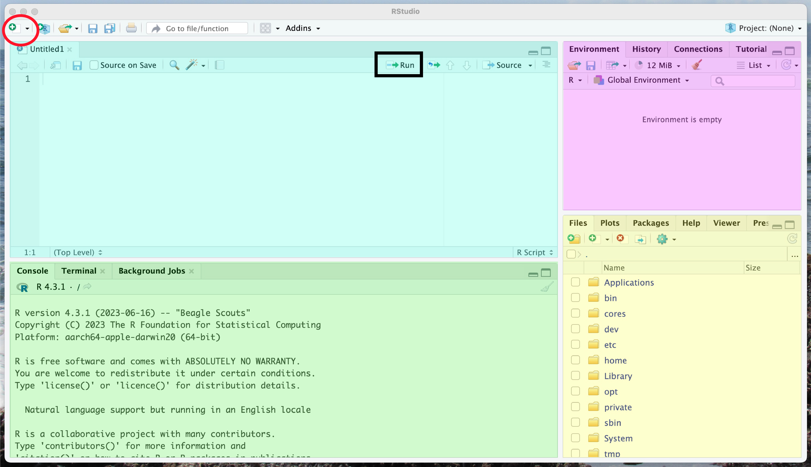

******

Welcome to this setup to this Introduction to R workshop. Whether you have used R before or if this is your first time every downloading R, there are a few things for you to do before our tutorial to make sure everything will run smoothly. 


# Downloading the software

We are going to be using R as well as R Studio to make our R experience a bit more user friendly. 

**IF YOU HAVE USED R AND RSTUDIO BEFORE, I WANT YOU TO GO INTO YOUR COMPUTER APPLICATIONS AND DELETE THE PROGRAMS** We are all going to start fresh so we have the most up to date versions and are all running the same things. 

## Downloading R

To download R, we are going to go to the CRAN website [https://cran.r-project.org/](https://cran.r-project.org/) and download the newest version for your computer. At the time of creating this workshop the current version is **R 4.3.1** When you have R downloaded, it should open without issues and show you this very not pretty script (Figure 1). Now if this works and looks like Figure 1, great, close R and never open it in this way again. 

{width="50%"}

### Troubleshooting

- Is your computer up to date? 

- Are you downloading the right version for your computer? Mac vs Windows, Intel vs M1/M2? 

- If your computer is older and cannot have the most current software, you will need to download an older version of R that will be supported by your operating system


## Downloading RStudio

In order to make R user friendly, we will be using R Studio to help us run R. This is *technically* optional but I really don't recommend using R on its own, you will have more errors, more difficulty troubleshooting errors and you will have to do a lot more by hand.

To download RStudio we are going to go to the posit website [https://posit.co/downloads/](https://posit.co/downloads/). Download the version for your computer and then open this application when you have downloaded it. If it works you should have a lovely RStudio environment that looks a little something like Figure 2. 

{width="50%"}

# Using RStudio

To help you get a bit acquainted with RStudio we will discuss the different sections of the RStudio program. First thing, for workflow, you will write your code in a **script**. These scripts will be saved and contain all the code you want to save and use every time you come back to this code. This needs to be written in chronological order because you will likely run the entire code each time you open RStudio so things need to be run in the correct order. To create a new script you click the little script button in the top left corner (the red circle in Figure 3) and select R Script. This will open the R script in the top left quadrant of your RStudio environment (the blue rectangle in the top left of Figure 3). The green rectangle below the script in Figure 3 is the console. It is where your code output will display and you can type code here, but **it will not be saved with the script**. The pink rectangle in the top right is the environment. This will show all the variables and objects that are created during your current R session, it is the objects that R will "remember" as you code so you can call on them later in your script. Your environment should be empty currently as we have not created any objects yet. Finally, the bottom right yellow rectangle has a few important tabs. At first it is showing your files, this will be useful for importing data during our tutorial. Also there is a plots tab, this is where plots you make will be outputted. Also there is a help tab which you can use to go and find help on different functions you are using. 

{width="80%"}

# Prepping Packages

For our workshop we will require some packages. Packages are extensions to R what will contain things like code and data that we can use in our coding. They will often contain a bunch of different functions which will allow us to easily perform different tasks without coding them by hand. To use functions from packages you have to do two things. 

  1. Install the package to your computer, so downloading the package from the online CRAN

  2. Access the package on your computer and load it into your working memory within RStudio
  

We will install a bunch of packages now so they are already downloaded into R for our tutorial. What you will need to do is run the following code without errors. There may be a few warnings which is completely okay, just no errors. To run code

  1. Copy the following code into a new R script in RStudio
  
  2. Starting at the first line, select the line of code and then push the run button at the top right of your script or you can use a shortcut (command + return for a mac or control + return for windows), this will run the line of code
  
  3. Wait for the code to run, if there is a small stip sign in the top right of your console, it is still running.
  
  4. Check the console messages and check that there was no error message outputted
  
  5. Repeat steps 2-4 for each line of code until you work through it all 


```{r installing packages, eval=FALSE}

#Installing packages
install.packages("dplyr")
install.packages("plyr")
install.packages("ggplot2")
install.packages("readxl")
install.packages("tidyr")

#Accessing each package to check that the install worked
library(dplyr)
library(ggplot2)
library(readxl)
library(tidyr)


```


Now you will get some messages for some of the library() codes, specifically the dplyr package which is normal, and they should look like this:

```{r library}

#Accessing each package to check that the install worked
library(dplyr)
library(ggplot2)
library(readxl)
library(tidyr)

```

Now that we have these programs and packages working and installed, we are ready for the BUGS workshop. I look forward to meeting you all soon.

If you have any questions, comments, or concerns feel free to reach out to me prior to the workshop at dominiquemaucieri@uvic.ca


